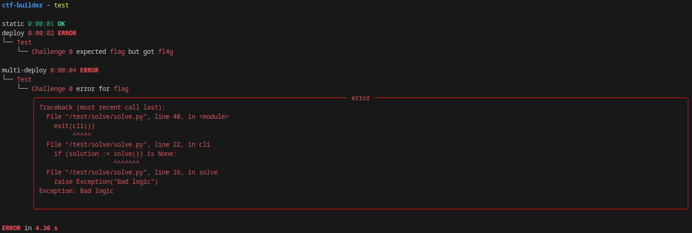

# 🚩 CTF Builder

A tool to build, test, and deploy CTFs.



## 📥 Installation

### 📦 Requirements

- [Docker](https://docs.docker.com/get-docker/)

### 🐍 PIP

System-wide:

```
pip install ctf-builder
```

[venv](https://docs.python.org/3/library/venv.html):

```
python -m venv .venv
source .venv/bin/activate
pip install ctf-builder
```

## ⚙️ Usage

All tools are available through the `ctf` executable. Documentation can found in the help menu.

```
ctf -h
```

Note: use the environment variable `CTF=/path/to/ctf` if the command is not being run inside a CTF package.

Have a look at the [sample](./sample) CTF for the structure of a CTF package.

## 📔 Documentation

```
ctf doc
```

Provides the [JSON schema](https://json-schema.org/) for `challenge.json`. This is automatically generated from [schema.py](ctf_builder/schema.py).

## 🎨 Schema

```
ctf schema
```

Validates `challenge.json`. Provides what type is expected and a useful comment for fields.


## 🔨 Build

```
ctf build
```

Builds challenge static files. This is useful for challenges that requires compiling binaries, making assets, etc. Instead of uploading the artifacts part of the repository they can stay separate.

## 🧪 Test

```
ctf test
```

Checks that solve scripts produce the provided flag. This is useful to validate that the challenge logic.

### 🌱 Environment Variables

The automatic testing provides the following environment variables to solve scripts.

```
CHALLENGE_ID - the challenge offset inside 'challenges' array.
CHALLENGE_HOST - deploy only: the challenge host name.
CHALLENGE_PORT - deploy only: the challenge port.

FLAG - the value of the flag to test.
FLAG_TYPE - the type of flag to test (static, regex).
```

## 🐋 Docker

```
ctf docker list
ctf docker start
ctf docker stop
ctf docker deploy
```

Deploys challenges to [Docker](https://docs.docker.com/get-docker/). This is useful for containerizing challenges.

### 🔌 Ports

Exposed/public ports **DO NOT** match the host port. This is to prevent collisions between challenges. Each challenge is allocated `5` public ports. These ports are assigned to challenges alphabetically, so if `a` has `1-5` then `b` will `6-10` etc. Integrations will make sure handle this. Ports can also be determined through [Docker](https://docs.docker.com/get-docker/).

```
docker container ls
```

### 🌐 Multi-deployment

Challenges can be deployed on multiple local virtual hosts. This can be used to provide every team their own infrastructure. 

#### 🖥️ Setup Hosts

Determine the IP range and interface for the network.

```
ip addr
```

Let's assume this is `eth0` and `192.168.0.0/24`. New IPs can be added for the number of infrastructures. 

```
sudo ip addr add 192.168.0.2/24 dev eth0
sudo ip addr add 192.168.0.3/24 dev eth0
...
```

#### 🚀 Deploy

The infrastructures can be deployed as follows.

```
ctf start --network team1 --ip 192.168.0.2 --network team2 --ip 192.168.0.3 ...
```

The shorthand version can also be used.

```
ctf start -n team1 -i 192.168.0.2 -n team2 -i 192.168.0.3 ...
```

## ⚓ Kubernetes

```
ctf k8s build
```

Deploys challenges to [Kubernetes](https://kubernetes.io/). This is the most robust way to deploy challenges.

## 🚩 CTFd

[CTFd](https://ctfd.io/) is supported out of the box. This allows to automate deploying challenges.

### 🔧 Dev

```
ctf ctfd dev
```

A simple development environment. Automatically spins up challenges without any hassle.

#### 🔑 Credentials

The credentials for the default/admin user is the following.

```
Name: admin
Password: admin
```

#### 🖥️ Interactive Console

By default, an interactive console is open when the environment spun up. This is an [argparse](https://docs.python.org/3/library/argparse.html), therefore acts like a CLI argument parser. Help for available commands can be accessed through `-h`. 

### 🚀 Deploy

```
ctf ctfd init
ctf ctfd deploy teams
ctf ctfd deploy challenges
```

Easiest way to get started is to run the [Docker container](https://docs.docker.com/get-docker/) for [CTFd](https://ctfd.io/).

```
docker run -p 8000:8000 -it ctfd/ctfd
```

The CTF can be initialized from the `ctfd/setup.json`.

```
ctf ctfd init -p ADMIN_PASSWORD
```

An access token is needed to make more changes. It should have the `ctfd_...` format.

```
http://localhost:8000/settings > Access Tokens > Generate
```

Teams can be added through `ctfd/teams.json`. A `ctfd/teams.out.json` will generated with the teams/users credentials.

```
ctf ctfd deploy teams -k ctfd_...
```

Challenges can be deploy as follows.

```
ctf ctfd deploy challenges -k ctfd_...
```
